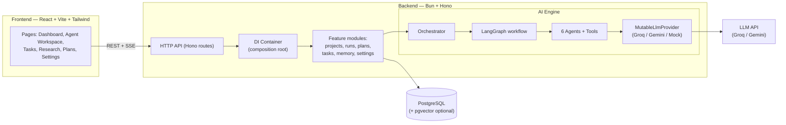
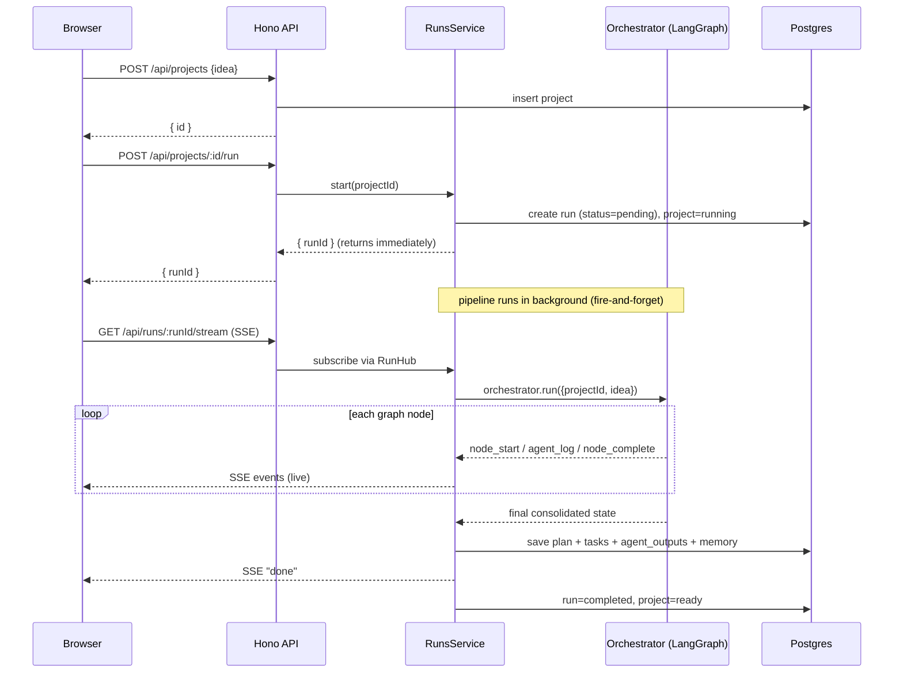
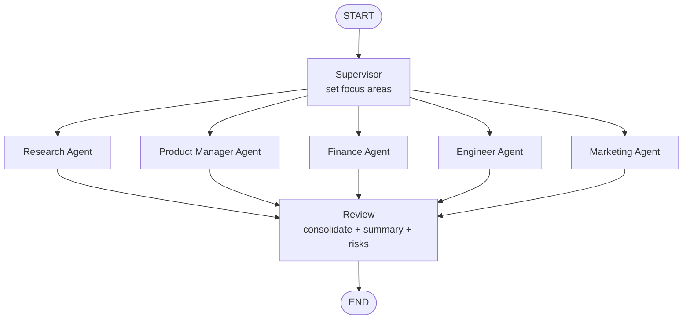
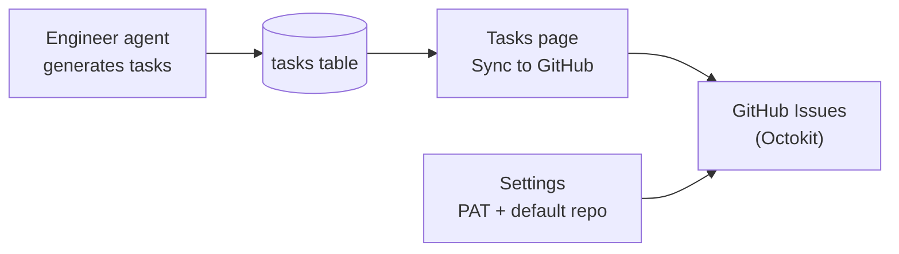

# FounderOS — How It Works

This document explains **what FounderOS does**, **how the system is built**, and the
**end-to-end workflow** from typing an idea to getting a full startup plan.

---

## 1. What is FounderOS?

FounderOS is an **AI-powered multi-agent startup copilot**. You give it a one-line
startup idea (e.g. _"AI-powered invoicing for freelancers"_) and a team of
specialized AI agents collaborate to produce a complete **startup operating
system**:

- **Market analysis** — size, growth, segments, trends
- **Competitor analysis** — who exists, strengths/weaknesses, positioning
- **Opportunities** — gaps worth pursuing
- **MVP definition + product roadmap**
- **Pricing strategy + financial model** (break-even, projections)
- **Technical architecture** — stack, components, data model, API surface
- **Go-to-market / launch plan** — channels, campaigns, content
- **A development task backlog** — concrete tickets the engineer agent generates

The agents are orchestrated with **LangGraph**. Everything they produce is
validated against **Zod schemas**, streamed live to the UI over **SSE**, and
persisted to **PostgreSQL** (with optional **pgvector** for semantic memory).

> It runs **fully offline** with a deterministic mock provider (no API key), and
> you can switch to a live model (Groq / Gemini) at runtime from the Settings UI.

---

## 2. A concrete example

```
You type:   "Team standup automation bot for Slack"
        │
        ▼
Supervisor sets focus areas → 5 specialists run in parallel → Reviewer consolidates
        │
        ▼
You get:    market sized at $X, 3 competitors, 5 MVP features, 3 pricing tiers,
            a 6-API architecture, a launch plan, and ~10 dev tasks — all in ~15s,
            saved to the database and viewable in the dashboard.
```

---

## 3. System architecture (high level)



- **Frontend** talks to the backend only through `/api/*` (Vite proxies it).
- **Backend** is feature-modular: each capability is a vertical slice
  (`routes → service → repository → schema`). A single **DI container**
  (`config/container.ts`) wires everything together.
- **AI Engine** is isolated under `src/ai/`: agents depend only on an
  `LlmProvider` interface, so the model is swappable.

---

## 4. The request lifecycle (what happens when you click "Run")



Key points:
- **`POST /run` returns instantly** with a `runId`; the pipeline runs in the
  background. The UI then opens an **SSE** stream to watch progress live.
- The **`RunHub`** is an in-memory pub/sub that buffers/replays events, so a
  client that connects slightly late still sees everything.
- The terminal **`done`** event is emitted by the service **after** persistence,
  so when the UI sees `done`, the plan and tasks are already saved.
- On any failure the run is marked `failed`, the project `error`, and an `error`
  event is streamed.

---

## 5. The multi-agent workflow (LangGraph)



**How the parallelism works:** The supervisor has edges to all five specialists,
so they all become runnable in the **same LangGraph superstep** and execute
concurrently. The `review` node has **five incoming edges**, which makes it a
natural **join/barrier** — it only runs after every specialist has finished.

| Stage | Node | Responsibility | Output (Zod schema) |
| ----- | ---- | -------------- | ------------------- |
| 1 | **Supervisor** | Understand the idea, set focus areas / plan | `SupervisorPlan` |
| 2 | **Research** | Market analysis, competitors, opportunities | `MarketAnalysis`, `CompetitorAnalysis`, `Opportunities` |
| 2 | **Product Manager** | MVP features + delivery roadmap | `ProductOutput` |
| 2 | **Finance** | Pricing tiers + financial model | `PricingStrategy`, `Financials` |
| 2 | **Engineer** | Architecture + **generated dev tasks** | `EngineerOutput` |
| 2 | **Marketing** | GTM / launch plan + content | `LaunchPlan` |
| 3 | **Review** | Consolidate everything, summary + risks + next steps | `FinalReview` |

Each agent:
1. (optionally) calls deterministic **tools** for its domain (e.g. the research
   agent uses web/market/competitor search tools; finance uses a calculator /
   revenue model; engineer uses architecture/db-schema/api-spec generators).
2. Builds a prompt and calls `llm.generateStructured({ schema, ... })`.
3. Returns a **state update** that LangGraph merges into shared state via reducers.
4. Emits `agent_log` custom events for the live activity feed.

---

## 6. Shared state

All agents read from and write to a single typed state object
(`ai/graph/state.ts`). Scalar fields are replaced by the latest writer; list
fields (`tasks`, `events`) use **append reducers** so parallel agents don't
overwrite each other.

```ts
GraphState = {
  projectId, idea,                 // inputs
  plan,                            // supervisor
  market, competitors, opportunities,  // research
  product,                         // product manager (mvp + roadmap)
  pricing, financials,             // finance
  architecture,                    // engineer
  launchPlan,                      // marketing
  review, summary,                 // reviewer
  tasks: [],                       // appended (engineer)
  events: [],                      // appended (all agents, for UI)
}
```

After the graph finishes, the orchestrator merges all node outputs into one final
state, which the `RunsService` then persists.

---

## 7. The LLM provider system

Agents depend only on the `LlmProvider` interface, so the actual model is fully
swappable. Three implementations exist:

| Provider | When used | Notes |
| -------- | --------- | ----- |
| **Groq** | API key set, provider = groq | OpenAI-compatible; drives `ChatOpenAI` with a custom `baseURL`. Default model `llama-3.3-70b-versatile`. |
| **Gemini** | API key set, provider = gemini | Google Generative AI via LangChain. |
| **Mock** | no key / provider = mock | Deterministic, schema-valid output. The whole pipeline + UI works offline. |

### Runtime configuration (Settings UI)

You don't need to edit `.env` to change the model. The **Settings page** lets you
pick the provider, model, base URL, and API key at runtime:

- A **`MutableLlmProvider`** delegate sits between the agents and the real
  provider. Saving settings hot-swaps the underlying provider, so the whole agent
  team uses the new model immediately — **no restart**.
- Settings persist to `backend/runtime-settings.json` (gitignored). Keys and
  models are stored **per provider**, so switching providers never loses a key.
- On boot, persisted settings are layered over the `.env` defaults.

Endpoints: `GET /api/settings/llm`, `PUT /api/settings/llm`,
`POST /api/settings/llm/test` (does a tiny live call to verify the key/model).

### Reliability features (Groq)

Free-tier models are flaky with strict schemas and rate limits, so the Groq
provider adds:
- **Self-correcting structured output** — if the model returns data that fails
  Zod validation, the exact error is fed back to the model to repair its output.
- **Concurrency gate** — serializes calls so the 5 parallel agents don't burst
  past the per-minute token limit.
- **Rate-limit-aware retry** — honors Groq's "try again in Xs" hint.

---

## 8. Data model (PostgreSQL)

| Table | Purpose |
| ----- | ------- |
| `projects` | One startup idea per row (status: draft/running/ready/error) |
| `runs` | One pipeline execution per row (status + error + timing) |
| `startup_plans` | The consolidated plan (each section stored as JSONB) |
| `tasks` | Dev tasks generated by the engineer agent |
| `agent_outputs` | Raw per-agent output for traceability/debugging |
| `conversations` | Per-project message log |
| `memories` | Long-term memory; `vector` column with pgvector, JSONB fallback otherwise |

**pgvector is optional.** The migrate script detects it:
- installed → `memories.embedding` is a real `vector` column with an IVFFlat index
  (ANN cosine search via the `<=>` operator);
- not installed → `embedding` is `JSONB` and recall uses in-app cosine similarity.

It auto-upgrades to a vector column on the next migrate once pgvector is installed.

---

## 9. Backend structure

```
backend/src/
├── main.ts            # Bun.serve + Hono entry
├── app.ts             # route assembly, CORS, error handler, /health
├── config/
│   ├── env.ts         # Zod-validated environment + provider resolution
│   └── container.ts   # DI composition root (builds + wires everything)
├── shared/
│   ├── logger.ts  errors.ts  result.ts
│   ├── http/          # respond, sse, middleware, validate
│   └── db/            # postgres client, migrations, migrate runner, helpers
├── ai/
│   ├── llm/           # provider interface, groq, gemini, mock, mutable, retry, factory
│   ├── embeddings/    # provider interface, gemini, mock
│   ├── agents/        # base + supervisor, research, product-manager, finance, engineer, marketing
│   ├── graph/         # state (reducers), workflow (LangGraph), orchestrator, events
│   ├── tools/         # research / finance / engineer / marketing tools
│   └── schemas.ts     # canonical Zod domain schemas
└── modules/           # feature slices: routes + service + repository + schema
    ├── projects/  runs/  plans/  tasks/  memory/  settings/
    └── github/  autonomy/   # GitHub (Phase 2) + autonomy (Phase 3)
```

Every module is the same shape:
`*.routes.ts` (HTTP) → `*.service.ts` (logic) → `*.repository.ts` (SQL) →
`*.schema.ts` (Zod types).

---

## 10. Frontend pages

| Page | What it shows |
| ---- | ------------- |
| **Dashboard** | Create a project from an idea; recent projects |
| **Agent Workspace** | Live agent activity (SSE) + the generated plan cards |
| **Projects** | All projects with status |
| **Tasks** | Kanban + **Sync to GitHub** (bulk-create issues for unsynced tasks) |
| **Research** | Market / competitor / opportunity subset of a plan |
| **Startup Plans** | A specific plan or history |
| **Settings** | Configure LLM + GitHub (token, default repo), test connections, memory search |

State/data fetching uses **React Query**; live runs use a custom **SSE hook**
(`lib/useRunStream.ts`).

---

## 11. API reference

| Method | Path | Description |
| ------ | ---- | ----------- |
| GET | `/api/health` | Status, DB, active provider/model |
| GET | `/api/projects` | List projects |
| POST | `/api/projects` | Create project `{ idea, name? }` |
| GET | `/api/projects/:id` | Get project |
| POST | `/api/projects/:id/run` | Start the pipeline → `{ runId }` |
| GET | `/api/runs/:id/stream` | **SSE** live pipeline events |
| GET | `/api/projects/:id/plan` | Latest consolidated plan |
| GET | `/api/projects/:id/plans` | Plan history |
| GET | `/api/projects/:id/tasks` | Generated dev tasks |
| GET | `/api/projects/:id/research` | Research subset |
| PATCH | `/api/tasks/:id` | Update a task |
| POST | `/api/memory/search` | Semantic recall |
| GET | `/api/settings/llm` | Current LLM config (no raw key) |
| PUT | `/api/settings/llm` | Update provider/model/baseUrl/apiKey |
| POST | `/api/settings/llm/test` | Test a provider/model/key live |
| GET | `/api/settings/github` | GitHub token status + default repo |
| PUT | `/api/settings/github` | Update GitHub token / default repo |
| POST | `/api/settings/github/test` | Verify GitHub token |
| GET | `/api/github/status` | GitHub integration status |
| POST | `/api/github/issues` | Create a GitHub issue |
| POST | `/api/github/projects/:id/sync` | Sync project tasks → GitHub issues |
| POST | `/api/github/review` | Post PR review comment |
| POST | `/api/autonomy/build` | _Phase 3 scaffold → 501_ |

**SSE event types:** `run_start`, `node_start`, `node_complete`, `agent_log`,
`done`, `error`.

---

## 12. Running it

```bash
bun install

# (optional) configure DB / keys
cp .env.example backend/.env

# database
bun run db:up        # docker pgvector, OR use your own Postgres
bun run db:migrate

# run backend (:8787) + frontend (:5173)
bun run dev
```

Then open **http://localhost:5173**:
1. **Settings** → pick your provider/model, paste a key, click **Test**, then **Save**
   (or leave it on **Mock** to run offline).
2. **Settings → GitHub** → paste a PAT with `repo` scope, set default repo, **Save**.
3. **Dashboard** → enter an idea → **Run**.
4. Watch the agents work live in **Agent Workspace**, then explore the plan,
   research, and generated tasks.
5. **Tasks** → **Sync to GitHub** to create issues for unsynced dev tasks.

> No key / want offline? Set the provider to **Mock** in Settings (or
> `LLM_PROVIDER=mock` in `backend/.env`) — the entire pipeline runs deterministically.

---

## 13. Phase 2 — GitHub integration (complete)



| Capability | How |
| ---------- | --- |
| Configure token | Settings → GitHub, or `GITHUB_TOKEN` in `.env` |
| Default repo | Settings → GitHub (`owner/repo`) |
| Bulk sync | Tasks page → **Sync N to GitHub** |
| Single issue | `POST /api/github/issues` |
| PR review | `POST /api/github/review` (posts summary comment) |
| Task linkage | `tasks.github_issue_number` + `github_issue_url` stored after sync |

**Roadmap status:** Phase 1 ✅ · Phase 2 ✅ · Phase 3 (autonomous build) — next.
